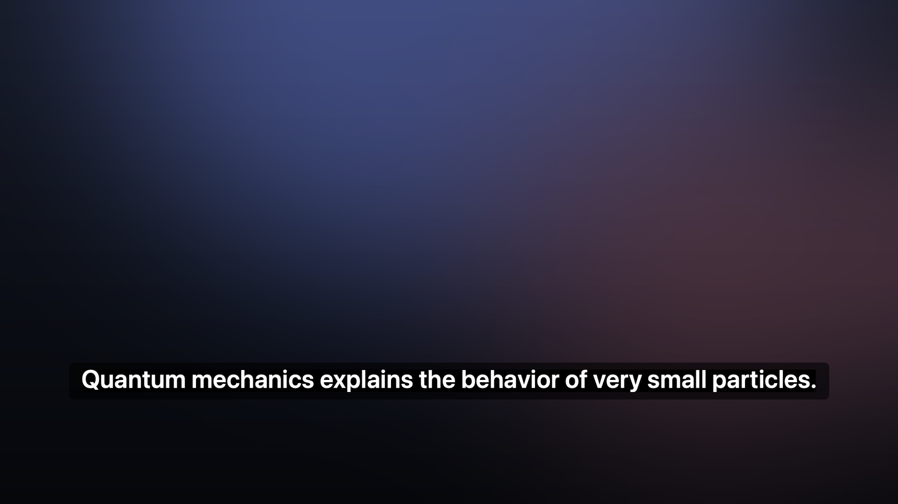

# Live Subtitles

[](https://github.com/martinx/LiveSubtitles/actions/workflows/ci.yml)
[](https://github.com/martinx/LiveSubtitles/releases/latest)
[](LICENSE)


Real-time **English** subtitles for anything playing on your Mac, plus a one-click
export of the whole session to `.srt`.

Runs in the menu bar, entirely on-device — no accounts, no cloud, and no audio ever
leaves the machine.



## Install

Grab the latest release — a disk image you drag to Applications:

**<https://github.com/martinx/LiveSubtitles/releases/latest>**

1. Open **LiveSubtitles.dmg** and drag **Live Subtitles** onto the Applications
   shortcut. (The release also carries `LiveSubtitles.zip` — that is what the in-app
   updater downloads.)
2. Launch it. macOS asks for **Screen Recording** — that is how system audio is read.
   Grant it under *System Settings → Privacy & Security → Screen Recording*, then
   relaunch if you had to change it.
3. Press <kbd>⌥</kbd><kbd>⌘</kbd><kbd>L</kbd> (or use the menu bar) to start listening.

The first run also downloads and compiles the speech model — see
[First run](#first-run).

## Requirements

- macOS 14+ (developed and measured on macOS 27, Apple M3)
- Apple Silicon (the speech models run on the Neural Engine)
- Xcode command line tools (`swift`)

## Build from source

```bash
git clone https://github.com/martinx/LiveSubtitles.git
cd LiveSubtitles
make install        # release build + copy to /Applications
```

| Command | What it does |
|---|---|
| `make` | release build → `build/LiveSubtitles.app` |
| `make run` | build and launch from `build/` |
| `make install` | build and copy to `/Applications` |
| `make debug` | debug build — faster to compile, slower to run |
| `make update` | `git pull`, rebuild, reinstall |
| `make check-update` | report whether the remote has new commits |
| `make icon` | regenerate `Resources/AppIcon.icns` |
| `make dist` | zip the app in `build/` without rebuilding it |
| `make dmg` | drag-to-Applications disk image, also without rebuilding |
| `make package` | `build`, then both artefacts |
| `make clean` | remove `build/` and `.build/` |

Then launch it like any other app — Spotlight (`Cmd-Space` → `Live Subtitles`),
Launchpad — or `open -a LiveSubtitles`.

The **Screen Recording** grant is tied to the app's signature, so updating in place
keeps the permission; if macOS asks again, re-grant it under *System Settings →
Privacy & Security → Screen Recording*.

## First run

1. **Screen Recording permission** — required to capture system audio. macOS prompts
   on first launch.
2. **The model downloads on first use** (433 MB for the 120M models, 594 MB for the
   0.6B ones) into `~/Library/Application Support/FluidAudio/Models/`.
3. **The first load also compiles the CoreML model**, which is why it can take
   40–90 s. That is a one-off: later launches load in about **2 s**, and the compiled
   model is cached system-wide.

## Using it

Click the captions bubble in the menu bar. The first line is the current state, and the
rest is the usual set of actions:

| Item | What it does |
|---|---|
| *(state)* | `Listening` / `Paused` / `Stopped` |
| Start Listening | Loads the model if needed and begins capturing |
| Pause Listening | Stops capturing, **keeps the model loaded** |
| Stop Listening | Stops capturing and **releases the model** |
| Clear Captions | Empties the on-screen text *and* the session transcript |
| Export Transcript… | Saves the session as `.srt` (or `.txt`) |
| Copy Transcript | Puts the whole transcript on the clipboard |
| Settings… | Engine, behaviour, appearance and shortcut options |
| Restart Engine | Rebuilds the engine after an engine setting changed |
| Check for Updates… | Asks GitHub for the latest release (see [Keeping up to date](#keeping-up-to-date)) |
| How to Use | The first-run walkthrough, any time |
| About Live Subtitles | Version, author, licence and links |
| Quit | Stops capture and exits |

The menu-bar icon reflects the state: a filled bubble while listening, a pause symbol
while paused, an outline bubble when stopped.

## Start, pause and stop

Three states, because "stop" and "pause" cost different things:

| State | Capture | Model | Coming back |
|---|---|---|---|
| **Listening** | running | loaded | — |
| **Paused** | stopped | still loaded | instant |
| **Stopped** | stopped | released (~600 MB back) | reloads the model, ~2 s |

Pause exists because the common case is stepping away for a minute: paying the model
load again would defeat the point. Stop exists because the common case there is "I am
not using this right now", where holding 600 MB is the wrong trade.

**The transcript is never touched by pausing or stopping** — only *Clear Captions*
empties it. You can stop mid-episode, come back, and export everything captured so far.

Whether the app starts listening on launch is a setting (*Start listening when the app
launches*, on by default).

## Shortcuts

Global, so they work while the video player is frontmost:

| Action | Default |
|---|---|
| Start listening | ⌥⌘L |
| Pause listening | ⌥⌘P |
| Stop listening | ⌥⌘. |

Change them in Settings → Shortcuts: click **Record**, press a combination containing at
least one modifier, or **Clear** to unbind. Escape cancels, Delete clears. A combination
another app already owns will silently not take effect.

These use Carbon's `RegisterEventHotKey` rather than `NSEvent`'s global monitor, because
monitoring the keyboard that way requires Accessibility permission — this app should not
have to ask for that just so you can pause.

The overlay is click-through and never takes focus, so it can sit over a full-screen
video without interrupting playback.

## Models

The engine is a setting, not a hard-coded choice. All are English, on-device, and run
on the Neural Engine.

| Model | Params | First word | Punctuation | Download |
|---|---|---|---|---|
| Parakeet EOU @160 ms | 120M | **0.63 s** | no | 433 MB |
| Parakeet EOU @320 ms | 120M | ~0.7 s | no | 433 MB |
| **Parakeet Unified @320 ms** (default) | 0.6B | 0.86 s | **yes** | 594 MB |
| Parakeet Unified @640 ms | 0.6B | ~1.0 s | yes | 594 MB |
| Nemotron @560 ms | 0.6B | **1.50 s** | yes | ~600 MB |

Measured on an M3 by playing a known sentence ("Quantum mechanics explains the
behaviour of very small particles") and timestamping the app's own output:

| | EOU 120M @160 ms | Unified 0.6B @320 ms | Nemotron 0.6B @560 ms |
|---|---|---|---|
| First word on screen | 0.63 s | 0.86 s | 1.50 s |
| Transcript | "…very small **part of**" | "…small **particles**." | "…small **particles**." |
| Style | run-on lowercase | punctuated, capitalised, numbers normalised | punctuated |

The default is the 0.6B model: ~0.2 s more latency buys correct words plus real
punctuation and capitalisation.

**Why not the 640 ms tier?** It is the same model, not a more accurate one: FluidAudio
describes it as *"same WER as 320 ms at ~2.5x the RTFx"* — it re-encodes far less
often. That is an efficiency tier, so it only helps a machine that is struggling for
compute. On an M3 the 320 ms tier runs comfortably, so 640 ms just adds 0.32 s of
delay for nothing.

**Why not Nemotron?** Measured 0.64 s slower to first word with no accuracy gain on
the test sentence. Worth trying only if a particular show trips up Parakeet.

## Settings

| Setting | Notes |
|---|---|
| **Start listening when the app launches** | On by default. Turn off to launch idle and start with a shortcut. |
| **Shortcuts** | Global Start / Pause / Stop bindings (own tab). |
| **Check for updates automatically** | Daily `GET` of the public GitHub releases API. No identifiers are sent. |
| **Model** | Which streaming speech model to run. Needs **Apply & Restart Engine**. |
| End of sentence after | How much silence closes a subtitle line. Needs **Apply & Restart Engine**. |
| **New line after silence** | Off / 2 / 3 / 5 / 8 s. After that much quiet, the next sentence starts a **fresh line** instead of being appended to the previous one. |
| **Keep captions on screen** | Stop the overlay fading out during quiet stretches. |
| **Show Dock icon** | Off by default — the app is a menu-bar accessory and never takes activation from the video. Turn on for a Dock icon, a Cmd-Tab entry, a full app menu, and a **LIVE** badge on the Dock tile while capturing. |
| **Drag to reposition** | On by default: grab the caption bar and put it where you want, and the spot is remembered. While it is on, the overlay takes clicks **on the bar itself**; turn it off to make the overlay fully click-through. |
| Font size / Width / Background / Distance from bottom | Apply immediately |
| Max lines | 1–5. 1 = current sentence only · 2 = previous line above it · 3+ gives the current sentence two lines and keeps more history. |

Once you have dragged the overlay, the saved position wins over *Distance from bottom*
until you press **Reset overlay position**.

### How captions appear and disappear

Worth knowing, because three separate things can clear the screen:

1. **New line (text dropped).** After `New line after silence` of *quiet audio*, the
   running line is discarded so the next sentence starts fresh. The break is applied
   when speech resumes, not during the pause — the last line stays readable while
   nothing is being said.
2. **Fade out.** Unless *Keep captions on screen* is on, the overlay fades out
   (`showsCaption = false`, 0.28 s) 6 s after the fade timer starts — i.e. after
   "new line" delay **plus** 6 s. With *Keep captions on screen* it never fades.
3. **Empty box.** The rounded background disappears whenever there is no text at all.

Pause detection runs on the **audio level**, not on the model going quiet: every one
of these models keeps emitting hallucinated words through silence, which resets a
text-based timer forever. The threshold adapts to the show (audio ~10 dB below the
recent peak, with a slow-decaying peak follower).

## Export format

Export writes SubRip (`.srt`). Cue bounds come from the **audio clock** — the moment a
cue's first words appeared and the moment its last new word arrived — so timings track
playback for every model family:

```
1
00:00:01,760 --> 00:00:04,280
He would rather the meeting is scheduled for tomorrow morning at nine.

2
00:00:07,800 --> 00:00:10,200
I told him to wait outside until the police arrive.
```

> **Timeline caveat:** the clock starts when capture starts, so cue times are relative
> to when you launched (or restarted) the engine. Start captions at the beginning of an
> episode if you want the `.srt` to line up with the file.

## Performance

Measured on an M3 with the default model:

| Metric | Value |
|---|---|
| ScreenCaptureKit buffers | 320 frames = **20 ms**, ~54 buffers/s |
| First word of a stream | **0.86 s** (0.63 s with EOU @160 ms) |
| Per-word lag once running (EOU @160 ms) | **0.1–0.2 s** |
| Model load, warm cache | **~2 s** |
| Model load, first ever use | 40–90 s (download + one-off CoreML compile) |
| Audio work per buffer | O(1) — no resampling, one 1.3 KB copy |

Design choices that keep it cheap:

- **One ordered consumer.** Audio is fed to the model from a single detached task via
  an `AsyncStream`, so buffers cannot be reordered and FluidAudio is only ever touched
  from one place.
- **The capture format is already the model's format.** ScreenCaptureKit is asked for
  16 kHz mono and delivers 16 kHz mono Float32, so nothing is resampled on the hot path.
- **O(1) cue segmentation.** A cue ends on a finished sentence when the model has
  punctuated one, otherwise after 700 ms without new words or 22 words. Line breaks
  come from audio energy — no per-show VAD to tune.
- **Cue text is tidied on the way out**: stranded leading marks are dropped, runs of
  punctuation collapse to the strongest mark (`..` → `.`, `,.` → `.`), a full stop is
  only appended after an actual word, and cues with no words at all are discarded.
- **Bounded rendering.** Only a trailing window of transcript is drawn, partials are
  only pushed when the text actually changed, and cues with no actual words (a stray
  `?` from noise) are dropped.
- **The engine is never reset between sentences** — resetting discards encoder context
  and can clip the start of the next line.

## Debugging

```bash
LIVESUBTITLES_DEBUG=1 make run                    # trace partials, cues, state, hot keys
LIVESUBTITLES_DUMP_SRT=/tmp/out.srt make run      # mirror the transcript to disk
LIVESUBTITLES_OPEN=settings make run              # also: welcome, about
```

Trace tags: `[partial]`, `[utterance]`, `[pause]`, `[newline]`, `[state]`, `[hotkey]`,
`[drag]`, `[status]`, `[cue]`.

## Icon

Original artwork, drawn from scratch by `scripts/make-icon.py` (Pillow): a dark
"screen" carrying a white caption card with two text lines and a speech tail, plus a
coral dot for "live". No third-party icon assets are used.

```bash
python3 scripts/make-icon.py      # writes icon_1024.png + a size-legibility strip
make build                        # bundles Resources/AppIcon.icns
```

## Architecture

```
Sources/LiveSubtitles/
├── App.swift                 entry point (accessory unless the Dock icon is on)
├── AppDelegate.swift         status item, status menu, app main menu, Dock state
├── GlobalHotKeyCenter.swift  system-wide hot keys (Carbon)
├── KeyShortcut.swift         a shortcut + its label and Carbon modifier mask
├── ShortcutRecorder.swift    click-to-record shortcut field
├── CaptionController.swift   wires everything; owns export + settings window
├── SystemAudioCapture.swift  ScreenCaptureKit -> AsyncStream<AVAudioPCMBuffer>
├── StreamingTranscriber.swift multi-model streaming ASR + cue segmentation + pauses
├── TranscriptStore.swift     timestamped cues -> .srt / .txt
├── CaptionModel.swift        committed vs in-progress text, fade-out
├── CaptionView.swift         rolling caption, finished and live text on separate lines
├── CaptionPanel.swift        non-activating, click-through, draggable overlay window
├── Settings.swift            UserDefaults-backed settings (+ migration)
└── SettingsWindow.swift      grouped-form settings UI
```

Data flow:

```
ScreenCaptureKit (16 kHz mono Float32, 20 ms buffers)
        │
        ▼
StreamingTranscriber ── selected model (EOU / Unified / Nemotron) on the ANE
        │  partial text            │  cue bounds from the audio clock
        │  audio-level pauses      │
        ▼                          ▼
   CaptionModel              TranscriptStore
        │                          │
        ▼                          ▼
   CaptionPanel              .srt / .txt export
```

## Why not the original Whisper pipeline

This began as a rewrite of an app whose macOS target used SwiftFasterWhisper. That
pipeline buffered a fixed **4.2 s** window (`WINDOW_SIZE_SAMPLES = 67200`) before every
decode, which put a hard ~4–6 s floor under subtitle latency that no model or parameter
change could remove. It also needed a 1.5 GB model and a CTranslate2 framework whose
headers were pruned, so it would not even compile without patching the dependency.

## Known limitations

- **English only.**
- **No punctuation from the EOU models.** The default 0.6B model punctuates and
  capitalises; switch to EOU and you get run-on lowercase with a full stop appended.
- **A committed cue is frozen.** Streaming models keep revising the sentence they are
  on, but once a cue has been cut and added to the transcript, later revisions are not
  written back into it.
- **No automatic recovery for the capture stream.** If ScreenCaptureKit stops (display
  change, permission change, monitor unplugged) audio goes dead until you pick
  **Restart Engine**.
- Word errors and occasional hallucination on music-heavy or heavily accented audio.

### Planned

- **Offline transcription of local files.** Point the app at an episode, transcribe it
  ahead of time with a batch model (Parakeet TDT v2 / Ultra) and export a perfectly
  timed `.srt` — zero latency and higher accuracy than any streaming pass, because the
  whole file is available up front. Streaming stays for anything that cannot be
  pre-processed.
- **Auto-reconnect the capture stream** so a display change does not need a manual
  restart.

## Keeping up to date

The app knows its own version and can update itself:

- **Automatically** — once a day it asks the public GitHub releases API for the latest
  tag, if *Check for updates automatically* is on (Settings → General). Nothing about
  you is sent; it is a plain `GET`.
- **On demand** — *Check for Updates…* in the menu.
- **Installing** — when there is a newer release, the menu offers *Update to x.y.z…*.
  It downloads the zip, unpacks it, checks that the bundle reports the expected version
  **and** passes `codesign --verify`, then hands the swap to a short script that waits
  for the app to exit, keeps a backup of the old bundle, and **rolls back if the swap
  fails**. That is deliberately not silent: the app carries a Screen Recording grant,
  and silently replacing it is a good way to end up with something that will not launch.
- **Self-install only works from `/Applications`.** Anywhere else the app says so rather
  than guessing.

If you built from source, `make update` pulls the latest commit, rebuilds and reinstalls.

## Privacy

Everything is on-device. There are exactly two network requests in the whole app:

1. **The speech model download** — one time, from Hugging Face, on first use.
2. **The update check** — a `GET` of the public GitHub releases API, at most once a day,
   and it can be switched off.

No audio, no transcript, no identifiers, no analytics, no account.

## Releasing

Tag and push; the [release workflow](.github/workflows/release.yml) builds the bundle,
stamps the version from the tag, and publishes a GitHub Release with
`LiveSubtitles.zip` attached:

```bash
git tag v0.2.0
git push origin v0.2.0
```

Without any secrets that produces a working but **ad-hoc signed** build: it runs, but on
someone else's Mac Gatekeeper blocks the first launch until they right-click → Open.
Signing with a **Developer ID Application** certificate and notarising removes that
warning completely.

### Signing and notarising

You need a **paid** Apple Developer Program membership (a Developer ID certificate
cannot be issued to a free team) and an App Store Connect API key.

#### The short path

1. **Create an API key.** appstoreconnect.apple.com → *Users and Access* →
   *Integrations* → *App Store Connect API* → `+`, role **Admin** or *App Manager*.
   Download the `.p8` (Apple only lets you download it once) and note the **Key ID**;
   the **Issuer ID** is shown above the key list.
2. **Run one command:**

   ```bash
   scripts/setup-signing.sh ~/Downloads/AuthKey_XXXXXXXXXX.p8
   ```

   It generates the private key and CSR locally, asks Apple to issue a **Developer ID
   Application** certificate for it, builds the `.p12`, imports it into your login
   keychain so local builds sign too, and uploads every secret the workflow needs.
3. **Prove it works without publishing:**

   ```bash
   gh workflow run release.yml -f tag=v0.1.2 -f dry_run=true
   ```

   The whole path runs — import the certificate, sign with hardened runtime and a secure
   timestamp, notarise, staple — and the artefacts are uploaded as workflow artefacts
   instead of a release. If *Import the Developer ID certificate*, *Notarise* and
   *Check Gatekeeper's verdict* are green, the next tag produces a download that just
   opens.

#### If you already have the certificate

Export it with its private key — Keychain Access → login → *My Certificates* →
right-click *Developer ID Application: …* → Export… → `.p12`, set a password — then:

```bash
scripts/make-signing-secrets.sh DeveloperID.p12 AuthKey_XXXXXXXXXX.p8
```

An `APPLE_ID` + `APPLE_APP_PASSWORD` + `APPLE_TEAM_ID` triple also works if you would
rather use an app-specific password than an API key. Every signing step is conditional,
so the workflow stays green with or without any of this.

> **Whose name appears?** A Developer ID is issued to a *team*. Users see that team's name
> in the Gatekeeper prompt — for example *"…was signed by Shanghai Dst Technology
> Co.,ltd."*. For a personal project under your own name you would need a separate,
> personally enrolled paid account.

The landing page in [`docs/`](docs) is published by GitHub Pages at
<https://subtitles.bitey.ai>.

## License

[MIT](LICENSE). Bundled third-party components and the model licences are set out in
[THIRD_PARTY_NOTICES.md](THIRD_PARTY_NOTICES.md) — notably FluidAudio, which is Apache 2.0
and is linked statically into the binary.

## Contributing

Bug reports and focused fixes are welcome — see [CONTRIBUTING.md](CONTRIBUTING.md).
The one hard rule: **everything stays on-device**.
